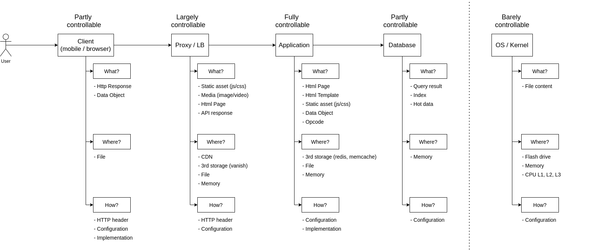
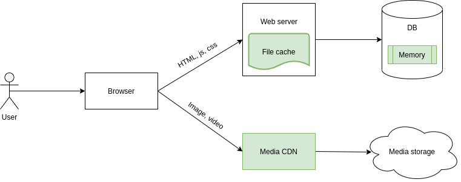
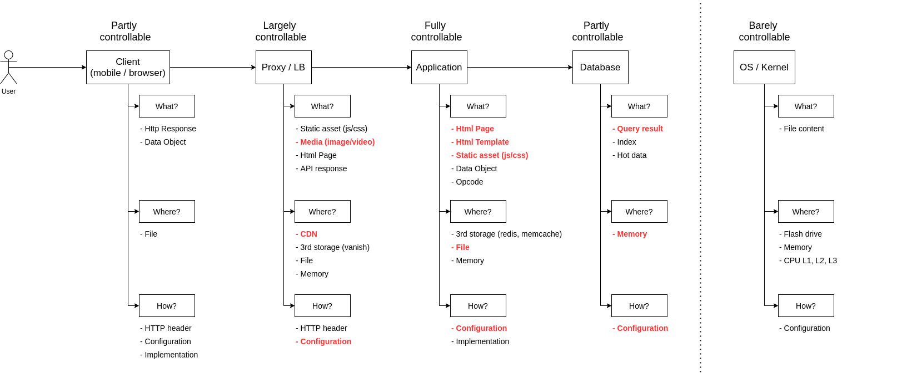
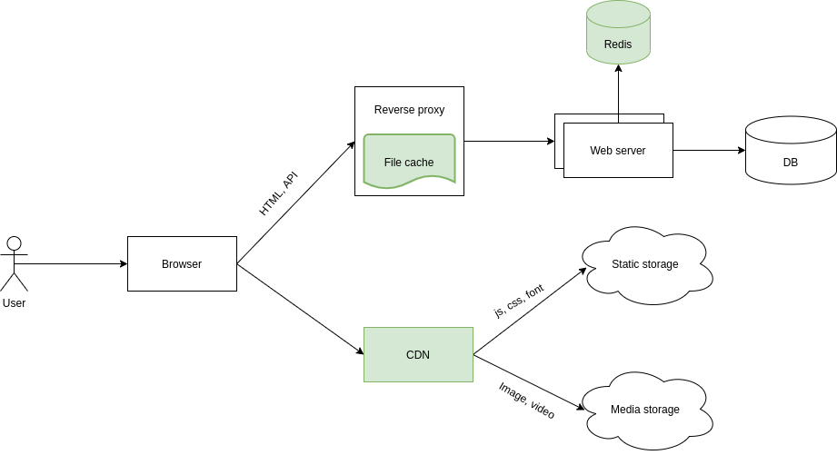
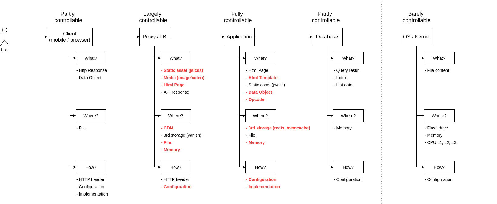

# CACHING - PHẦN 1

## 1. Những concept cơ bản
- Caching là hành động lưu trữ lại kết quả của action tốn thời gian để phục vụ lại để sử dụng nhanh hơn
- Tiêu chí để xem có cần cache hay không:
  + Tốn nhiều time/resource
  + Kết quả dừng lại được nhiều lần
  + Ví dụ: 
    + Data get từ DB mất 500ms nhưng chỉ request 1 lần trong 1 trong ít ai vào -> ko cần cache
    + Đoạn CSS build mất 100ms nhưng tất cả user  cần phải load -> cần cache

## 2. Bức tranh lớn về caching

- 4 layer khi caching 1 application là:
  + Client 
  + Proxy 
  + Application
  + Database

## 3. Các câu hỏi cần giải đáp khi caching:
- Cache cái gì ?
- Cache ở đâu?
- Cache trong bao lâu?

## 4. Các level caching

### 4.1 Level 1 : Một web monolith với 1 server
- Bài toán:
  + Một web monolith, chạy trên 1 server, render data html chủ yếu là các trang tin tức, crud, Data còn khá nhỏ
  + Những điều làm cho web bị chậm:
    + Một trang html có thể được gender bởi 10-40 query DB, độ trễ 2-3s
    + Media data (image/video) trên trang load chậm làm trang bị trắng 2-10s

- Phương án dùng cache:
  + 
  + 
  
- Cụ thể các tầng layer như sau:
  + Cache html, css, js  bằng file
  + Cache 1 phần trang html hoặc toàn bộ trang html bằng file
  + Cache media bằng CDN
  + Bật tính năng query cache trong DB

  
3.2 Level 2: Một web monolith với nhiều server
- Bài toán 
  + Một web monolith, chạy trên nhiều server, do đó sai kahcs data giữa các server khi dùng file cache cần phải được giải quyết
  + Lượng trafic cao  -> Cần phải focus mạnh và cache toàn trang để giảm gánh nặng DB và APP
  + Lượng dữ liệu  lớn hơn, nhưng cấu hình DB thì nhỏ
  + Có hệ thống proxy/LB đứng phía trước
  
- Phương án dùng cache:
  + 
  + 

- Cụ thể cache các tầng layer như sau:
  + Cache data object và html template bằng storage thứ 3
  + Cache thêm static asset trên CDN
  + Cache toàn bộ trang trên Reverse Proxy (nginx, hadoop)

3.3 Level 3 : Web API cùng với SPA
- Bài toán: 
  + Ứng dụng mở rộng tới mobile và web Single Page App
  + SinglePageApp chứa toàn bộ html, js, css của ứng dụng và có thể triển khai dạng tĩnh
  + Web API chỉ chứa data, do đó application không mất resource để render html template
  + Client phải gọi nhiều request tới server hơn
  + 

